# Notes
- All Linux distributions supply a shell program from the GNU Project called bash. The name is an acronym for bourne-again shell.
- Terminal emulator like KDE use konsole and GNOME uses gnome-terminal gives access to shell
- Shell prompt: username@machinename
- If last character of the prompt is a hash mark (#) rather than dollar sign, the terminal has superuser privileges
- Several terminal sessions run in background called virtual consoles accessed by pressing `CTRL-ALT-F1` through `CTRL-ALT-F6`.
- `date` : display current time and date
- `df` : amount of free space on disk drives
- `free` : amount of free memory
---------------------------------------------------------------------------------------------------------------
- Unix/Linux the first directory in the file system is called root directory. It contains files, folders and subdirectories. Storage devices are attached (mounted) at various points on the tree.
- Windows has separate file system tree for each storage device.
- `pwd` : current working directory
- `ls` : list contents of directory
- Absolute pathname begins with the root directory.
- Relative pathname start with working directory.
- filenames that begin with period character are hidden.
- `ls -a' : list hidden files
- Unix doesn't use file extension to determine contents of the file
- `cd -` : change working directory to previous directory
- `ls -l` : list files in long format with more detail
---------------------------------------------------------------------------------------------------------------
- `command -options arguments`
    command from GNU project support long options consisting of a work preceded by two dashes `ls -lt --reverse`

  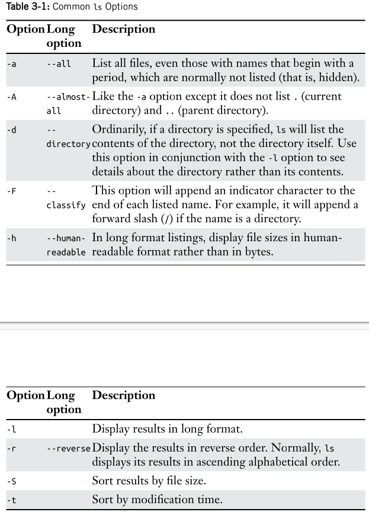
  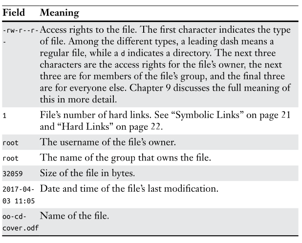
- `file filename` : brief description of file contents
- `less filename` : examine human-readable text
- ASCII maps keyboard characters to numbers

  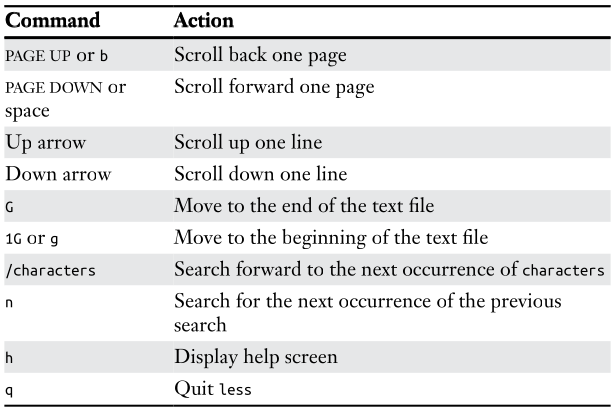
  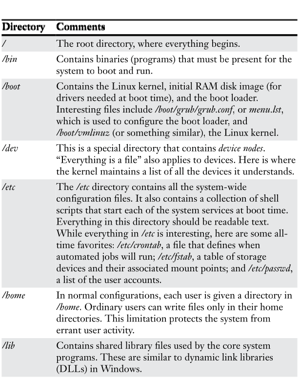
  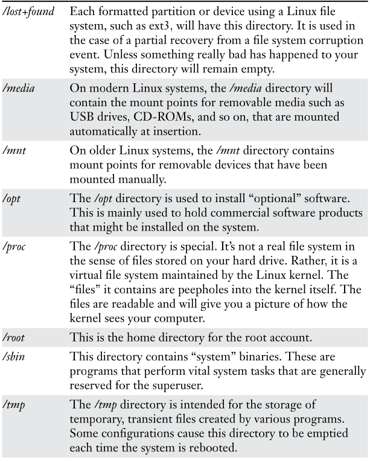
  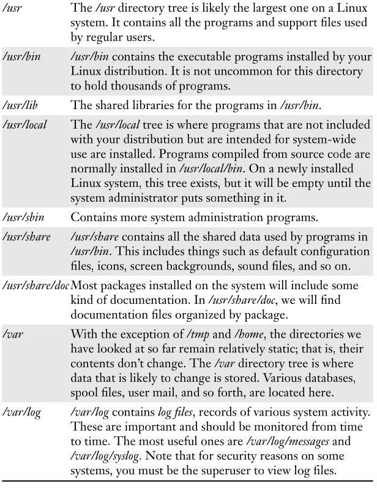
- Symbolic links/soft link/ symlink/ has l in the beginning and are useful in updating new versions of libraries where an old library name will be a symlink to new library file

  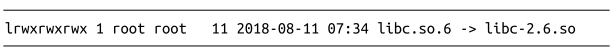
- Hard links allow files to have multiple names in a different way
---------------------------------------------------------------------------------------------------------------
- Using wildcards (globbing) allows to select filenames based on patterns of characters

  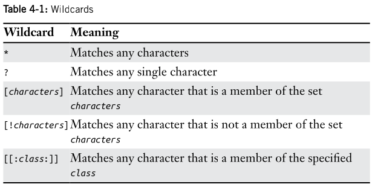
  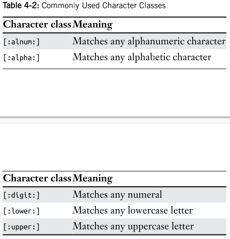
  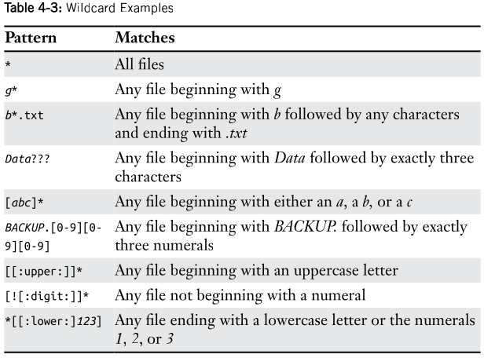
- Nautilus - file manager for GNOME
  Dolphin & Konqueror - file managers for KDE
  GNOME and KDE are desktop environments for Linux
- `mkdir dir1 dir2 dir3` : to create directory
- Options for cp

  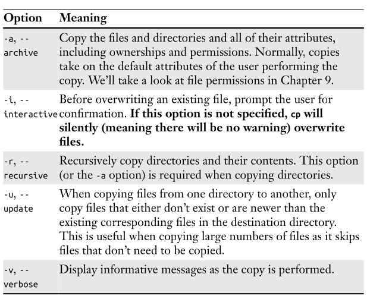
  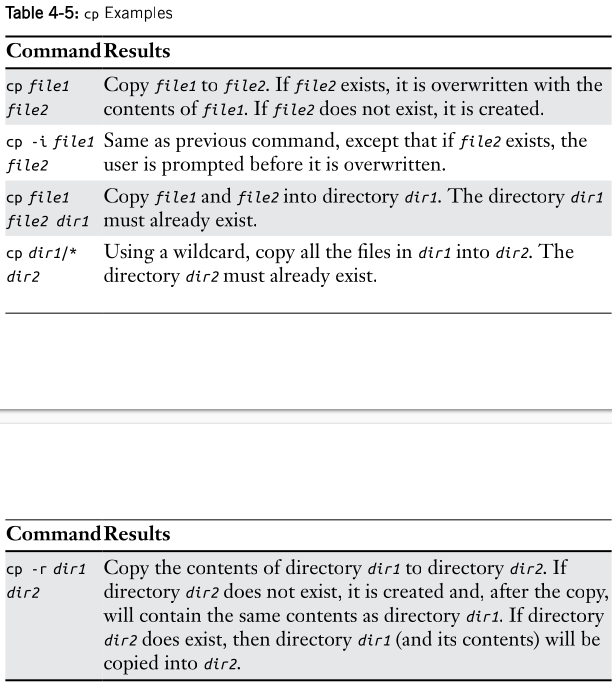
-Options for move

  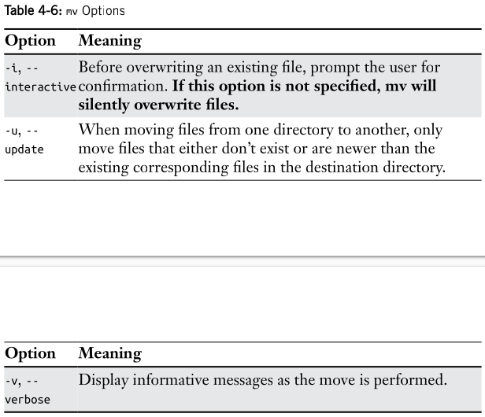
  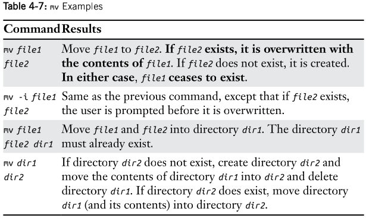
---------------------------------------------------------------------------------------------------------------
- Commands:
  - Executable : /usr/bin files, compiled binaries written in C/C++, scripting languages
  - Command built in shell itself : shell builtins e.g. cd
  - Shell function
  - An Alias : Command we define ourself, built from other commands
- `type` command : displays the kind of command
- `which command` : determine exact location of an executable
- `help command` : get help for shell builtins
  - Square brackets in description indicate optional items
  - Vertical bar character indicates mutually exclusive items
  - Many executable support --help option
- `man program` : get manual documentation
  - A title (page's name)
  - Synopsis of the command's syntax
  - Description of commands purpose
  - Listing and description of each of command's option

  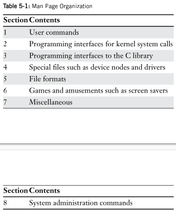
  
  e.g. `man 5 passwd`
