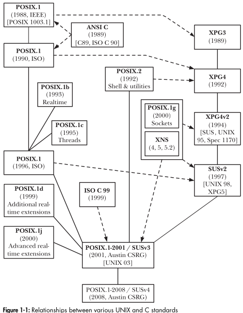

# Notes
- Programming features specific to Linux
    1. epoll, mechanism for obtaining notification of I/O events
    2. inotify, a mechanism for monitoring changes in files and directories
    3. capabilities, a mechanism for granting a process a subset of the powers of the superuser
    4. extended attributes
    5. i-node flags
    6. the clone() system call
    7. the /proc file system
    8. Linux-specific details of the implementation of file I/O, signals, timers, threads, shared libraries, interprocess communication, and sockets.
-----------------------------------------------------
- Unix definitions:
    - Operating systems that have passed the official conformance tests for the Sin- gle UNIX Specification and thus are officially granted the right to be branded as “UNIX” by The Open Group (the holders of the UNIX trademark).
    - Systems that look and behave like classical UNIX systems
- History:
    - First UNIX implementation by Ken Thompson at Bell Laboratories. Dennis Ritchie implemented C. UNIX kernel was then entirely written in C. 
    - Evolving development version were developed at AT&T
    - Under name Berkley Software Distribution (BSD) version of UNIX developed at University of California at Berkeley was distributed. 4.1BSD and 4.2BSD became basis for SunOS.
    - System III produced by AT&T's UNIX support Group (USG). Later System V was released.
- Linux refer to entire UNIX-like of which Linux Kernel forms a part
- Richard Stallman started GNU project (GNU's not UNIX) to develop an entire, freely available, UNIX-like system. He founded Free Software Foundation (FSF)
- GNU project led to development of GNU General Public License (GPL)
- Much of the software in a Linux distribution, including the kernel, is licensed under the GPL or one of a number of similar licenses.
- Software licensed
under the GPL must be made available in source code form, and must be freely redistributable under the terms of the GPL. Modifications to GPL-licensed soft-ware are freely permitted, but any distribution of such modified software must also
be under the terms of the GPL. If the modified software is distributed in executable form, the author must also allow any recipients the option of obtaining the modified source for no more than the cost of distribution. The first version of the
GPL was released in 1989. The current version of the license, version 3, was released in 2007. Version 2 of the license, released in 1991, remains in wide use, and is the license used for the Linux kernel.
- GNU produced Emacs, GCC (GNU C compiler), bash shell, glibc (GNU C library)
- Linux Torvalds took inspiration from Minix written by Andrew Tanenbaum. He wrote the UNIX kernel called Linux as all UNIX clones have a ending letter X.
- Bill and Lynne Jolitz developed port of BSD system for the x86-32 knows as 386/BSD. This was another free UNIX. Two alternative groups appeared:
    - NetBSD : emphasizes portability to a wide  range of hardware platforms. 
        - OpenBSD appeared from NetBSD and emphasized security
    - FreeBSD : emphasizes performance and is the most wide-spread of the modern BSDs
        - Dragonfly BSD
- Linux release are numbered x.y.z: x representing a major release, y a minor release and z a revision of minor release. Previously there were two Kernel versions stable (even minor version) and development branch (odd minor version).
- Slackware, Debian (non-commercial), SUSE, Red Hat, Ubuntu are distribution (Linux Kernel + automated installation process + creating file system + installing Kernel and other required software)
- Standardization
    - C standardization lead to American National Standards Institute (ANSI) C standard and was accepted as an ISO standard. C99 is last adopted ISO standard.
    - POSIX (Portable Operating System Interface) refers to a group of standard developed under auspices of Institute of Electrical and Electronic Engineers (IEEE), specifically its Potable Application Standards Committee (PASC). Goal os PASC is to promote application portability.
        - POSIX.1 documents an API for a set of services that should be made available to a program by a conforming operating system. An operating system that does this can be certified as POSIX.1 conformant. POSIX.1 based on UNIX system call and C library function API
        - POSIX.2 standardized the shell and various UNIX utilities, including command-line interface of C compiler
    - FIPS (Federal Information Processing Standard) is standard specified by US government. FIPS standard required some features that POSIX.1 left as optional.
    - X/Open Company consortium formed bty international group od computer vendors. X/Open Portability Guide, a series of portability  guides based on the POSIX standards. XPG3 followed by XPG4 are important guide releases.XPG4 version 2 was repackaged as Single UNIX specification (SUSv1) also called UNIX 95. SUSv2 called UNIX98 (XPG5) was released later. X/Open merged with Open Software Foundation (OSF) to form The Open Group. OSF had IBM, HP, Apollo, Digital etc.
    - IEEE, The Open Group and ISO collaborated in Austin Common Standards Revision Group (CSRG) to consolidate POSIX standards and Single UNIX specification. POSIX 1003.1-2001 or POSIX.1.2001 or SUSv3 was the result. IT replaces SUSv2 and POSIX.1 and POSIX.2.
    - SUSv3 is divided into 4 parts:
        - Based definitions (XBD): Definitions, terms, concepts, and specifications of the contents of header files
        - System Interfaces (XSH): System calls or library functions
        - Shell and Utilities (XCU): Operation of the shell and various UNIX commands.
        - Rationale (XRAT): Informative text and justifications relating to the earlier parts.
        - SUSv3 also has X/Open CURSES Issue 4 Version 2 (XCURSES) specification
    - SUSv4 adds new specifications for a range of functions.

      
    - Linux development aims to conform to UNIX standards, POSIX and SUS. No Linux distribution is branded as UNIX by The Open Group
    - There are multiple Linux distributors and because the kernel implementers don’t control the contents of distributions, there is no “standard” commercial Linux as such. Each Linux distributor’s kernel offering is typically based on a snap shot of the mainline (i.e., the Torvalds) kernel at a particular point in time, with a number of patches applied.
-----------------------------------------------------
- Linux Kernel resides at then pathname /boot/vmlinuz
